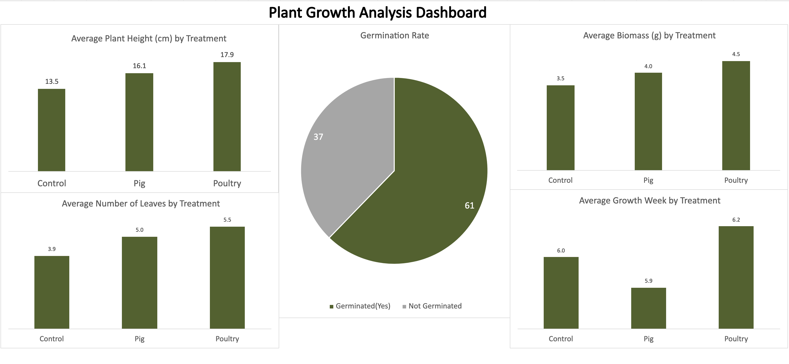
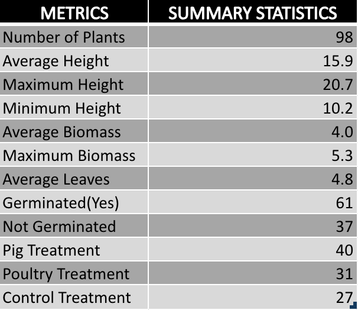
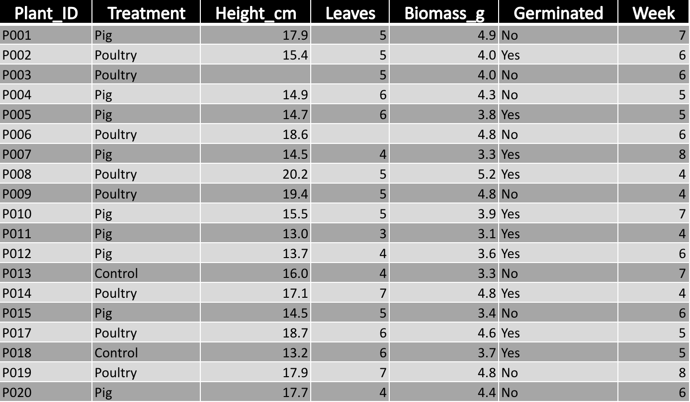

# 🌱 Plant Growth Data Analysis

## Project Overview

This project demonstrates my ability to clean, organize, analyze, and visualize biological research data using Microsoft Excel.

The dataset contains plant growth measurements collected under different fertilizer treatments.

## Objectives

- Clean messy biological data
- Remove duplicates
- Handle missing values
- Perform Exploratory Data Analysis (EDA)
- Build Pivot Tables
- Create Pivot Charts
- Design an interactive dashboard

---

## Tools Used

- Microsoft Excel (Excel Online)
- Pivot Tables
- Pivot Charts
- Dashboard Design

---

## Key Findings

- Poultry manure produced the highest average plant height.
- Poultry manure also resulted in the highest average biomass.
- Poultry treatment generated the highest average number of leaves.
- Overall germination rate was approximately **62%**.

---

## Files Included

- 📊 Dashboard.png
- 📈 EDA_Summary.png
- 📄 Raw_Data.png
- 📁 Plant_Growth_Analysis.xlsx

---

## Dashboard Preview

See **Dashboard.png** for the completed visualization.

## Dashboard

## Exploratory Data Analysis (EDA)

## Raw Dataset

---

## Author

**Alor Chisom Lydia**

Aspiring Data Analyst | Biotechnology Graduate | Learning Data Analytics
